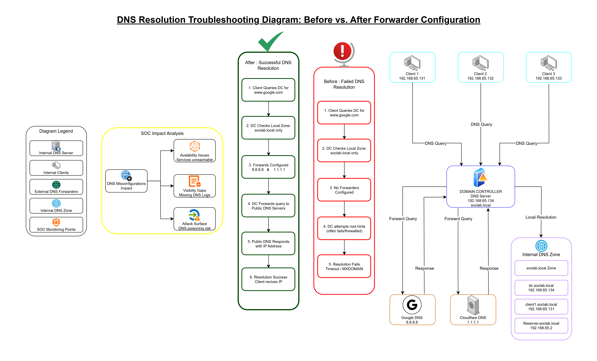

# DNS Forwarder Misconfiguration Causing Internet Outage After Domain Controller Promotion

## Issue Overview
After promoting a Windows Server to a Domain Controller, internet connectivity was lost for all domain-joined clients and the server itself. While internal resources and direct IP connectivity worked, external domain name resolution failed.

This issue was caused by missing DNS Forwarder configuration on the Domain Controller, preventing external DNS resolution.

---
## Diagram

## Network Architecture

### Internal Clients
All clients rely on the Domain Controller for DNS resolution:

- Client 1: 192.168.65.131
- Client 2: 192.168.65.132

### Domain Controller / DNS Server
- IP Address: 192.168.65.134
- Domain: soclab.local
- Role:
  - Authoritative DNS server for internal domain
  - DNS forwarder for external queries

### Public DNS Forwarders
- Google DNS: 8.8.8.8
- Cloudflare DNS: 1.1.1.1

---

## Symptoms Observed
- Successful ping to public IPs (e.g., 8.8.8.8)
- Failed DNS resolution for external domains (e.g., google.com)
- Internal domain resolution (soclab.local) functioning correctly
- Issue affected:
  - Clients: 192.168.65.131–132
  - Domain Controller: 192.168.65.134

---

## DNS Resolution Flow

### ❌ Before: Failed External Resolution
1. Client (192.168.65.131) queries DC for www.google.com
2. DC (192.168.65.134) checks local DNS zone
3. Local zone only contains soclab.local records
4. No DNS Forwarders configured
5. DC attempts root hints
6. Root server access blocked by firewall/network rules
7. Client receives NXDOMAIN or timeout

### ✅ After: Successful External Resolution
1. Client (192.168.65.132) queries DC for www.google.com
2. DC checks local zone (not found)
3. DNS Forwarders enabled
4. Query forwarded to 8.8.8.8 / 1.1.1.1
5. Public DNS returns valid IP
6. Client receives correct response and connectivity is restored

---

## Internal DNS Zone Records
The Domain Controller maintains internal name resolution for the following:

- dc.soclab.local → 192.168.65.134
- client1.soclab.local → 192.168.65.131
- client2.soclab.local → 192.168.65.132

---

## Root Cause Analysis
When the server was promoted to a Domain Controller, it became the primary DNS server for all domain-joined systems. By default, it only resolved records within its own internal zone.

Without DNS Forwarders configured, the Domain Controller had no reliable method to resolve external domains, leading to internet outages despite functional network connectivity.

---

## Resolution Steps
1. Log into Domain Controller (192.168.65.134)
2. Open DNS Manager (Server Manager → Tools → DNS)
3. Right-click the server and select Properties
4. Navigate to the Forwarders tab
5. Add the following forwarders:
   - 8.8.8.8
   - 1.1.1.1
6. Apply changes
7. Flush client DNS cache using `ipconfig /flushdns`
8. Validate external resolution

---

## Validation & Testing

### From Clients (192.168.65.131–132)
